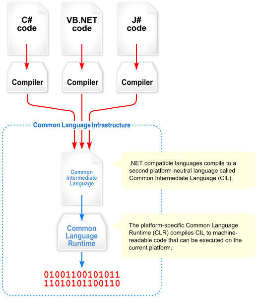

# 1 - 簡介

## 一、背景
### C# 為 **Micro Soft** 於2000年問世的一套新程式語言

## 二、架構

### **C# / VB.NET**     --- **CIL** -->     **CIL / MSIL code**     --- **CLR** -->     Native code

---
### **CIL (Common Intermediate Language)**

**通用中間語言**
- 主要使用語言:
	1. C#
	2. VB.NET
	3. C++/CLI

---
### **MSIL (Microsoft Intermediate Language)**

**微軟中間語言**

目前官方改為CIL

---
### **CLR (Common Language Runtime)**

**通用語言執行平台 / 通用語言運行庫**

---
## 三、.NET(Framework) V.S .NET Core

- ## .NET(Framework) --> **WINDOWS OS**
- ## .NET Core --> **跨平台**
	

## 四、啟發語言
- ## C++
- ## Java

## 五、差異
- ## C/C++		指標
- ## C# 		委派

## 特性
- ### 物件導向 OOP - Object-oriented programming
- ### 強型別
- ### 垃圾記憶體回收機制
- ### 隱含轉換

- ### 優點
	- 微軟提供支援
	- 語法簡潔
	- 相較 C/C++ 更容易上手
	- 未來進行 ASP.NET 開發較容易上手

---
# Reference:
- [Wiki C#](https://zh.wikipedia.org/wiki/C%E2%99%AF)
- [Wiki CLR](https://en.wikipedia.org/wiki/Common_Language_Runtime)
- [Wiki CIL](https://zh.wikipedia.org/wiki/%E9%80%9A%E7%94%A8%E4%B8%AD%E9%97%B4%E8%AF%AD%E8%A8%80)
- [.NET Framework](https://zh.wikipedia.org/wiki/.NET%E6%A1%86%E6%9E%B6)
- [.NET Core](https://zh.wikipedia.org/wiki/.NET_Core)
- [C# 語言和 .NET Framework 簡介](https://docs.microsoft.com/zh-tw/dotnet/csharp/getting-started/introduction-to-the-csharp-language-and-the-net-framework)
- [釐清 CLR、.NET、C#、Visual Studio、ASP.NET 各版本之間的關係](https://blog.miniasp.com/post/2015/07/28/Clarify-the-versions-between-CLR-NET-CSharp-Visual-Studio-and-ASPNET.aspx)

---
# [上一章][上一章] --- [下一章][下一章]

[上一章]: 0.md
[下一章]: 2.md